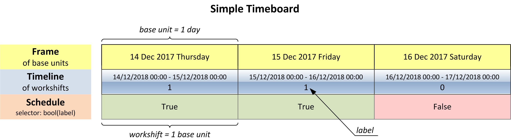
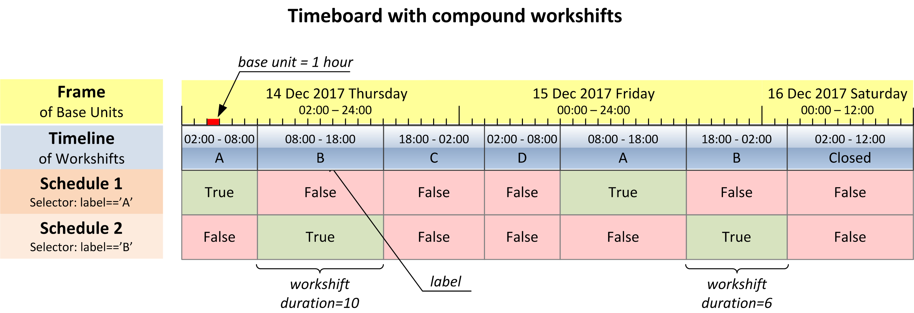

**********
Data Model
**********

.. contents:: Table of Contents
   :depth: 2
   :local:
   :backlinks: none

Timeboard
=========

Timeboard is a representation of a custom business calendar. 

More precisely, **timeboard** is a collection of work *schedules* based on a specific *timeline* of *workshifts* built upon a reference *frame*. 

.. note::

    The terms *workshift*, *frame*, *timeline*, and *schedule* have exact meanings that are explained below. On the other hand, word *calendar* is considered rather ambiguous. It is used occasionally as a loose synonym for *timeboard* when there is no risk of misunderstanding.

Timeboard is the upper-level object of the data model. You use timeboard as the entry point for all calculations. 

Workshift
=========

**Workshift** is a period of time during which a business agent is either active or not. 

No assumptions are made about what "business" is and who its "agents" may be. It could be regular office workers, or operators in a 24x7 call center, or trains calling at a station on specific days. 

The activity state of a workshift is called **duty**; therefore for a given business agent the workshift is either "on duty" or "off duty". It is not relevant whether the agent is continuously active through the workshift, or takes breaks, or works only for a part of the workshift. The duty is assigned to a workshift as a whole. 

It is up to the user to define and interpret periods of time as workshifts in a way which is suitable for user's application. For example, when making plans on the regular calendar of 8-hour business days, you do not care about exact working hours. Hence, it is sufficient to designate whole days as workshifts with business days being "on duty" workshifts, and weekends and holidays being "off duty". On the other hand, to build working schedules for operators in a 24x7 call center who work in 8-hour shifts you have to designate each 8-hour period as a separate workshift.

Note that both "on duty" and "off duty" periods are called "workshifts" although *work*, whatever it might be, is not carried out by the business agent when the duty is off.  Generally speaking, though not necessarily, some other business agent may operate a reversed schedule, doing *work* when the first agent is idle. For example, this is the case for a 24x7 call center.

Frame and Base Units
====================

The span of time covered by the timeboard is represented as a reference frame. **Frame** is a monotonous sequence of uniform periods of time called **base units**. The base unit is atomic, meaning that everything on the timeboard consists of an integer number of base units.

Timeline
========

**Timeline** is a continuous sequence of workshifts laid upon the frame. 

Each workshift covers one or more base units of the frame. The number of base units constituting a workshift is called the **duration** of the workshift. Different workshifts do not necessarily have the same duration.

Each base unit of the frame belongs to one and only one workshift. This means that workshifts do not overlap and there are no gaps between workshifts.

Each workshift is given a **label**. The type and semantic of labels are application-specific. Several or all workshifts can be assigned the same label.

Labels are essential for defining the duty of the workshifts.

Interval
========

**Interval** is a continuous series of workshifts within the timeline. Number if workshifts in an interval is called the **length** of the interval. Interval contains at least one workshift.

Schedule
========

Schedule defines duty status of each workshift on the timeline according to a rule called **selector**. Selector examines the label of a workshift and returns True if this workshift is considered on duty under this schedule, otherwise, it returns False.

Timeboard contains at least one ("default") schedule and may contain many. Each schedule employs its specific selector. The default selector for the default schedule returns ``bool(label)``.

The same workshift may have different duty statuses under different schedules.

For example, let the timeline consist of calendar days where weekdays from Monday through Friday are labeled with 2, Saturdays are labeled with 1, and Sundays and holidays are labeled with 0. The schedule of regular business days is obtained by applying selector ``label>1``, and under this schedule, Saturdays are off duty. However, if children attend schools on Saturdays, the school schedule can be obtained from the same timeline with selector `label>0`. Under the latter schedule, Saturdays are on duty.

.. _compound-workshifts-section:

Compound Workshifts
===================

It is important to emphasize that, when working with a timeboard, you reason about workshifts rather than base units. Duty is a property of workshift, not of a base unit. All calendar calculations are performed either on workshifts or on intervals. 

In many cases, workshift coincides with a base unit. The only reason to be otherwise is when you need workshifts of varying duration. Let's illustrate this point with examples.

When reasoning about business days, the time of day when working hours start or end is not relevant. For the purpose of the calendar, it suffices to label a whole weekday as "on duty" in spite of the fact that only 8 hours of 24 are actually taken by business activity.

Moreover, if the number of working hours do vary from day to day (i.e. Friday's hours are shorter) and you need to track that, the task can be solved just with workshift labeling. A workshift still takes a whole day, and within week workshifts are labeled as ``[8, 8, 8, 8, 7, 0, 0]`` reflecting the number of working hours. The default ``selector=bool(label)`` works fine with that. Therefore, while actual workshifts do have varying duration, you do not *need* to model this in the timeline. You can use a simpler timeboard where each workshift correspond to a base unit of one calendar day.

Now consider the case of a 24x7 call center operating in 8-hour shifts. Clearly, a workshift is to be represented by an 8-hour period but this does not necessarily call for workshifts consisting of 8 base units, each base unit one hour long. When building the frame, you are not limited to use of base units equal to a single calendar period, i.e. one hour, one day, and so on. You can take a base unit which spans multiple consecutive calendar periods, for example, 8 hours. Therefore, in this case, there is still no need to create workshifts consisting of several base units, as 8-hour base units can be directly mapped to 8-hour workshifts.

However, the things change if we assume that the call center operates shifts of varying durations, i.e. 08:00 to 18:00 (10 hours), 18:00 to 02:00 (8 hours), and 02:00 to 08:00 (6 hours). 

Now the base unit has to be a common divisor of all workshift durations which is one hour. (Technically, it also can be two hours, which does not make the case any simpler, so we will stick to the more natural one-hour clocking.) 

This case cannot be elegantly handled by workshifts bound to base units. This way we would end up, for any day, not with three workshifts of 10, 8 and 6 hours long but with a succession of 24 one-hour workshifts of which either 10, 8 or 6 consecutive ones will be labeled as "on duty". Creating meaningful work schedules and performing calculations for such timeline would be a rather cumbersome challenge. Therefore we have to decouple workshifts from base units and create the timeline where individual workshifts have durations of 10, 8, and 6 base units in the repeating pattern.

Having said that, while in many cases a workshift will coincide with a base unit, these entities have different purposes.

A workshift comprising more than one base unit is called **compound workshift**.

